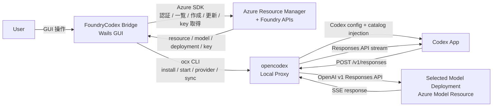
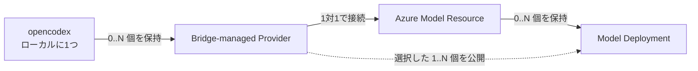

# アーキテクチャ

FoundryCodex Bridge は、Public Azure 上の Microsoft Foundry リソースとスタンドアロン Azure OpenAI リソースのデプロイ管理、および opencodex への適用を行う Windows 専用 Wails デスクトップアプリである。Foundry Project は管理対象にしない。Codex App への統合は直接行わず、Codex 設定の注入、モデルカタログ同期、復元は opencodex の責務として扱う。

## 参照情報

- [opencodex README](https://github.com/lidge-jun/opencodex): インストールコマンド、`ocx start`、ダッシュボード、Windows 対応、CLI。
- [opencodex Codex Integration](https://opencodex.me/guides/codex-integration/): opencodex が `$CODEX_HOME/config.toml` と Codex モデルカタログを冪等かつ復元可能に編集すること。
- [opencodex Management API](https://opencodex.me/reference/management-api/): ダッシュボードと headless `ocx` コマンドが同じ制御プレーンを使うこと。
- [opencodex Adapters](https://opencodex.me/reference/adapters/): `azure-openai` アダプターが Azure OpenAI Responses API を対象とし、`api-key` 認証を使うこと。
- [Microsoft Azure AI Services Deployments API](https://learn.microsoft.com/en-us/rest/api/aiservices/accountmanagement/deployments/create-or-update?view=rest-aiservices-accountmanagement-2024-10-01): デプロイ作成・更新、SKU、Capacity、モデル名、バージョン、Go SDK サンプル。
- [Microsoft Foundry Accounts - List Models](https://learn.microsoft.com/en-us/rest/api/microsoftfoundry/accountmanagement/accounts/list-models?view=rest-microsoftfoundry-accountmanagement-2025-06-01): リソースでデプロイ可能なモデル、能力値、SKU、Capacity の取得。
- [Azure-Samples/ai-model-start](https://github.com/Azure-Samples/ai-model-start): Responses API 対応モデルを ARM の `capabilities.responses` と `capabilities.agentsV2` から判定する Microsoft 公式サンプル。
- [Foundry Models from partners and community](https://learn.microsoft.com/en-us/azure/foundry/foundry-models/how-to/configure-marketplace): Marketplace 契約、必要権限、SaaS リソース要件。
- [Azure Identity for Go](https://learn.microsoft.com/en-us/azure/developer/go/sdk/authentication/authentication-overview): Azure SDK の認証モデル。
- [azidentity Go package](https://pkg.go.dev/github.com/Azure/azure-sdk-for-go/sdk/azidentity): `InteractiveBrowserCredential` によるブラウザ対話認証。
- [Wails project layout](https://wails.io/docs/gettingstarted/firstproject/): Wails 標準の `frontend`、`build`、`go.mod`、`wails.json` 構成。
- [Wails Windows guide](https://wails.io/docs/guides/windows/): WebView2 ランタイム要件と配布時の扱い。

## 第1段階の実装状況

Issue #2 では、Azure の既存 Model Resource と既存 Model Deployment を読み取り、明示的な Sync で opencodex へ反映する縦断機能までを実装する。Deployment の作成・更新、Provider の解除、複数 deployment の公開、Marketplace 契約、Azure RBAC の変更は後続段階の対象である。

第1段階の実装は、Azure SDK のブラウザ認証と一覧取得、Node.js/npm の前提確認、必要時のユーザー単位 opencodex 導入、`ocx service install`、Provider と PrimaryKey の登録、custom model と selected model の反映、`ocx sync`、Responses endpoint の接続テストを含む。起動時の処理は読み取り専用で、Sync は GUI から明示的に実行する。

## システム境界

## 責務

### FoundryCodex Bridge

- プロジェクト側で管理するマルチテナント Entra パブリッククライアントの client ID を使い、アプリ内で Azure へサインインする。
- Azure SDK の名前付き永続キャッシュと `AuthenticationRecord` で、前回のサインインを再利用する。
- 同時に有効な Azure アカウントは1つとし、GUI からアカウントを切り替える。
- サインインユーザーが参照できる tenant と subscription を一覧する。
- GUI ではアカウント、tenant、subscription の順に1つずつ選択し、選択中の tenant の認証コンテキストだけを使用する。
- `kind = AIServices` の Microsoft Foundry リソースと `kind = OpenAI` のスタンドアロン Azure OpenAI リソースを検出し、Azure Model Resource としてユーザーに選択させる。
- Model Deployment、Deployable Model、SKU、Capacity、プロビジョニング状態を表示する。
- GUI 操作から Model Deployment を作成または更新する。
- opencodex へ適用するタイミングで、選択中の Azure Model Resource の endpoint と PrimaryKey を取得する。SecondaryKey は opencodex へ渡さない。
- opencodex のインストール、起動、停止、状態確認を行う。
- GUI から opencodex を更新できるようにする。
- opencodex の常駐は `ocx service` に委ね、Bridge は Task Scheduler や昇格処理を直接実装しない。
- Azure Model Resource の OpenAI v1 互換 endpoint 用に opencodex Provider を追加または更新する。
- Azure Model Resource ごとに Bridge-managed Provider を1つ作成し、複数リソースの Provider を同時に保持する。
- GUI から Bridge-managed Provider を opencodex から解除する。Azure リソースは削除しない。
- opencodex の health、モデル登録、sync を公開 `ocx` CLI で実行する。JSON 対応コマンドは構造化出力を解析し、非対応コマンドは終了コードと標準エラーを扱う。
- Bridge 自身は tenant、subscription、resource group、account、deployment などの非 secret な選択状態だけを settings.json へ保存する。Azure の `AuthenticationRecord` は認証レコードファイルへ保存し、トークンキャッシュは Azure SDK に委ねる。

### opencodex

- `~/.opencodex/config.json` と opencodex 側の認証情報保存を管理する。
- `$CODEX_HOME/config.toml`、`$CODEX_HOME/opencodex.config.toml`、`$CODEX_HOME/opencodex-catalog.json`、その他 Codex カタログ状態を管理する。
- 停止またはアンインストール時に Codex のネイティブ設定を復元する。
- Codex に公開する最終的な routed model catalog を決定する。
- `azure-openai` アダプターで Codex Responses API トラフィックを Azure Model Resource の OpenAI v1 互換 endpoint へ中継する。

### Codex App

- opencodex が生成した Codex 設定とモデルカタログを読む。
- モデルリクエストを opencodex に送る。
- FoundryCodex Bridge から直接編集されない。

## 関係と多重度

- 1つの Bridge-managed Provider は、1つの Azure Model Resource の endpoint と API key だけを使用する。
- 1つの Azure Model Resource に対して作成する Bridge-managed Provider は最大1つとする。
- 1つの Bridge-managed Provider は、対応する Azure Model Resource 配下で選択された複数の Model Deployment を Codex へ公開できる。
- Bridge-managed Provider は、公開する Model Deployment のうち必ず1つを既定モデルとして持つ。
- Sync は選択中の Azure Model Resource に対応する Bridge-managed Provider だけを追加または更新し、他の Provider は変更しない。

### 既定モデル

- GUI では公開対象の Model Deployment を複数選択でき、その中から既定モデルを1つ明示指定する。
- 初回選択時は先頭の Model Deployment を仮の既定モデルにするが、Sync 前に変更できる。
- 既定モデルを公開対象から外した場合は、別の公開対象を既定に指定するまで Sync を実行できない。
- opencodex Provider の `defaultModel` には Model Deployment name を設定する。

### Provider ID

- 初回 Sync 時にユーザーが Provider ID を指定できる。
- 既定値は `az-<Azure Model Resource name>` とする。
- `ocx provider list --json` で既存 Provider との重複を検証し、重複する場合は別の ID を求める。
- Bridge は Azure resource ID と Provider ID の対応を設定へ保存する。
- 登録済み Provider ID は変更しない。別名にする場合は既存 Provider を削除し、新しい ID で登録し直す。
- GUI では Provider ID とは別に Azure Model Resource name、subscription、region を表示する。

### Provider の所有範囲

- Azure resource ID と Provider ID の対応が Bridge の設定に存在する Provider だけを Bridge-managed Provider とみなす。endpoint が一致するだけの既存 Provider を自動採用しない。
- Bridge-managed Provider では adapter、base URL、PrimaryKey、default model、live models、custom models、selected models を Bridge の管理対象とする。利用者がこれらを opencodex 側で変更した場合は差分として表示し、明示された次回 Sync で選択内容へ戻す。
- opencodex 全体の default Provider、Combo、model cost、Bridge が管理していない Provider は変更しない。ただし Disconnect のために default Provider の明示的な変更が必要な場合は、利用者が選択した代替先だけを設定する。
- 対応表にある Provider が外部で削除されていた場合、Provider ID が未使用なら次回 Sync で再作成する。同じ Provider ID が別の設定で使用されている場合は上書きせず、競合として Sync を停止する。

### Provider の解除

- GUI で Provider ID と Azure Model Resource name を表示し、確認後に実行する。
- 対象が opencodex 全体の default Provider である場合、GUI で別の有効な Provider を明示選択させ、`ocx provider set-default <replacement>` が成功した後に削除する。
- 代替となる有効な Provider が存在しない場合は Disconnect を実行せず、opencodex が最後または既定の Provider を削除できない理由を表示する。
- 対象を参照する opencodex Combo が存在する場合は Disconnect を実行せず、CLI が返す依存 Combo 名を表示する。Bridge は Combo を自動変更・削除しない。
- `ocx provider remove <provider-id> --json` が成功した後にだけ、Azure resource ID と Provider ID の対応を Bridge の設定から削除する。
- 解除後に `ocx sync` を実行し、Codex のモデルカタログを更新する。
- Azure Model Resource と Model Deployment は変更・削除しない。
- 解除した Provider は、対象の Azure Model Resource を再度 Sync すれば復元できる。

## Azure フロー

1. Bridge は保存済みの `AuthenticationRecord` があれば永続キャッシュからサインインを再利用し、利用できない場合は `InteractiveBrowserCredential` で職場または学校アカウントへサインインする。
2. Bridge は `armsubscriptions` でサインインアカウントがアクセスできる tenant を一覧する。
3. ユーザーは tenant を1つ選択し、Bridge はその tenant の認証コンテキストで subscription を一覧する。
4. ユーザーは subscription を1つ選択する。
5. Bridge は選択された subscription 配下から `Microsoft.CognitiveServices/accounts` を列挙し、`kind = AIServices` または `kind = OpenAI` のリソースだけを Azure Model Resource 候補として表示する。
6. ユーザーは resource group と Azure Model Resource を選択する。Foundry Project は列挙・選択しない。
7. Bridge は `armcognitiveservices` で deployment を一覧する。
8. Bridge は `AccountsClient.NewListModelsPager` で選択 resource にデプロイ可能な model、version、SKU、capacity、capabilities を取得する。
9. Codex 用の候補には Codex Candidate Model だけを表示する。OpenAI 形式は `capabilities.responses == true`、非 OpenAI 形式は `capabilities.agentsV2 == true` を条件とし、モデル名の固定リストは持たない。これらは任意キーの能力値であるため、実リクエストの成功保証とは扱わない。
10. ユーザーは GUI から deployment を作成または更新する。
11. Bridge は Sync 実行時だけ endpoint と key 一覧を取得し、PrimaryKey だけを opencodex へ渡す。SecondaryKey は応答から破棄し、保存・転送しない。

### Azure RBAC

- Bridge は Azure ロール割り当てを作成・更新しない。
- サインイン成功と操作権限を分離し、一覧取得、deployment 作成・更新、key 取得の各境界で Azure の認可結果を扱う。
- 初期機能で必要な主な操作は、対象リソースの read、`Microsoft.CognitiveServices/accounts/deployments/write`、`Microsoft.CognitiveServices/accounts/listKeys/action` とする。
- 権限不足時は Azure のエラーから不足操作と対象 scope を GUI に表示し、管理者へ渡せる権限依頼文を生成する。特定の組み込みロールが常に最小権限であるとは断定しない。
- `Microsoft.Authorization/roleAssignments/write` は要求しない。

### Azure local authentication

- opencodex の現行 `azure-openai` アダプターは非空の API key を要求するため、Azure Model Resource の local authentication が無効な場合は Sync 対象にできない。
- Bridge は Azure Model Resource の `disableLocalAuth` を確認し、有効な場合は deployment 管理画面を読み取り・更新できても、Sync を無効にして理由を表示する。
- 短寿命の Entra access token を API key として opencodex に保存する代替処理は行わない。
- 将来 opencodex が Azure Entra 認証と token refresh を公開契約として提供した場合にだけ、別途対応を検討する。

### Azure Marketplace

- すでに対象 subscription で Marketplace 契約済みのモデルは、通常の Model Deployment 作成フローで利用できる。
- Bridge は Marketplace offer の購入、利用条件への同意、agreement 署名、SaaS リソース作成を行わない。
- 未契約モデルの deployment が Marketplace 契約不足で失敗した場合は、権限不足や capacity 不足と区別して GUI に表示する。
- Marketplace 契約に必要な subscription-level 権限を Bridge の通常要件に含めない。

### Deployment 種別

- 初期版は `Microsoft.CognitiveServices/accounts/deployments` として管理される通常の Model Deployment を対象とする。
- pay-per-token、Standard 系、Provisioned 系など、Accounts Deployments API が返す SKU を扱う。
- `Microsoft.CognitiveServices/accounts/managedComputeDeployments` は列挙、作成、更新、Sync の対象にしない。
- Managed Compute 固有の GPU SKU、accelerator capacity、runtime、起動状態は実装しない。

### Model version 更新

- Bridge 独自の version upgrade policy 既定値は設けず、Azure の既定に従う。
- 新規 Model Deployment 作成時、利用者が明示的に選択しない限り `versionUpgradeOption` を送信しない。
- Azure が upgrade policy の選択肢を提供する場合は、`OnceNewDefaultVersionAvailable`、`OnceCurrentVersionExpired`、`NoAutoUpgrade` を GUI から選択できる。
- 既存 Model Deployment の更新では、利用者が変更しない限り現在の `versionUpgradeOption` を維持する。
- 現行 Azure で未設定値が `OnceCurrentVersionExpired` 相当であることは表示してよいが、Bridge の独自既定値として固定しない。

## opencodex フロー

1. Bridge はシステムの Node.js と npm の存在およびバージョンを確認する。
2. Node.js または npm が存在しない、あるいは opencodex の要件を満たさない場合、Bridge は処理を止め、GUI でユーザーに Node.js のインストールまたは更新を求める。Bridge 自身は Node.js をインストールしない。
3. Bridge は `PATH` 上の `ocx` を探索し、既存インストールがあればバージョンを固定せずに利用する。
4. `ocx` が存在しない場合、Bridge はシステムの npm を使い、`%LOCALAPPDATA%\FoundryCodexBridge\opencodex` 配下へ `@bitkyc08/opencodex@latest` をユーザー単位でインストールする。グローバル npm 環境と `PATH` は変更しない。
5. 初回 Sync では `ocx service install` を実行し、opencodex 標準の Windows Task Scheduler バックグラウンドサービスを登録・起動する。Task Scheduler 登録、必要な昇格、安全確認、ロールバックは opencodex に委ね、Bridge は直接扱わない。
6. 以後の起動、停止、状態確認、修復は `ocx service` と `ocx health --json` で行う。Codex shim は使用しない。opencodex の既定希望 port は `10100` だが、Bridge は `health` / `status` が返す実際の port を使用する。
7. Bridge は公開 `ocx` CLI で、選択中の Azure Model Resource に対応する Bridge-managed Provider を追加または更新する。API key はコマンドライン引数に含めず、`ocx account add-key` の標準入力へ渡す。
   - adapter: `azure-openai`
   - base URL: Azure Model Resource の OpenAI 互換 endpoint の `/openai` まで。opencodex が `/v1/responses` を付加する。
   - API key: 選択した Azure Model Resource の PrimaryKey。保存とマスクは opencodex に委ねる。
   - default model: 選択した Model Deployment name
   - live models: off。Azure のモデル列挙は Bridge が ARM から行う。
   - custom models: 選択した Model Deployment name を `ocx models add` で登録する。
   - selected models: 対応する Azure Model Resource から opencodex に公開する deployment names
8. Bridge は `ocx models list-custom --json` の結果と選択内容を比較し、Bridge-managed Provider に属するカスタムモデルを `ocx models add` / `ocx models remove --yes` で同期する。
9. Bridge は `ocx models selected <provider-id> --set <deployment-names> --json` と `ocx sync` を実行する。
10. catalog sync 後、Bridge は選択した各 Model Deployment に対して opencodex の公開 Responses endpoint 経由で固定の最小リクエストを順番に送り、実接続を検証する。model には `<provider-id>/<deployment-name>`、入力には固定文字列を使い、`stream: false`、`store: false`、小さい `max_output_tokens` を指定する。応答本文の文言は判定せず、Responses API として正常な応答を受け取れたことを成功条件とする。このリクエストには Azure の利用料金が発生し得ることを Sync 実行前の画面に表示する。
11. 接続テストの失敗は Provider 設定や catalog sync をロールバックする条件にしない。GUI に Model Deployment ごとの成功・失敗と Azure から返されたエラーを表示する。
12. 通常の Sync では Codex App を自動停止しない。opencodex が既存 app-server のカタログ保持を報告した場合だけ、GUI に「Codex を再起動して反映」を表示する。
13. ユーザーが注意確認後に明示実行した場合だけ、Bridge は `ocx sync --restart-codex` を実行する。

### Sync の失敗と再実行

- Sync は同一アプリ内で同時に1つだけ実行する。
- 各段階の直前に opencodex の現在状態を公開 CLI から取得し、必要な差分だけを適用する。
- 途中で失敗しても、完了済みの Provider、key、custom model、selected model 操作を Bridge が巻き戻さない。
- GUI は各段階を `未実行`、`成功`、`失敗` で表示し、失敗したコマンドの安全なエラー情報を示す。API key と token は表示しない。
- 再実行時は最初から現在状態を読み直し、未完了または不一致の段階だけを収束させる。
- 接続テストの失敗は Sync の設定適用失敗と区別する。

### Sync の実行契機

- Bridge 起動時は Azure と opencodex の状態を読み取り、差分と前提条件を表示するだけとする。
- 起動時に Provider、custom model、selected model、Codex Catalog、opencodex service を自動変更しない。
- 差分がある場合は GUI に `Sync が必要` と表示し、利用者の明示操作で Sync を開始する。
- `自動同期` は、明示された1回の Sync 内で必要な CLI 操作と接続テストを順番に完了させることを意味し、常駐監視や起動時 mutation は意味しない。

### opencodex port

- Bridge は既存 opencodex が使用中の port を変更せず、`ocx health --json` または `ocx status --json` が返す実 port を利用する。
- Bridge-managed opencodex の初回インストールでは port を固定せず、opencodex の既定挙動に委ねる。希望 port が使用中なら opencodex が選んだ空き port を採用する。
- GUI で利用者が port を明示変更した場合だけ、`ocx config set port <number> --json` を実行し、opencodex 標準の service 操作で再起動する。
- Bridge は Codex の base URL を直接変更せず、port 変更後の反映も `ocx sync` に委ねる。

Bridge は opencodex のバージョン範囲による利用拒否を行わない。GUI から利用者が opencodex を更新でき、Bridge が必要とする公開 CLI 操作が失敗した場合は、その操作をエラーとして表示する。非互換への対応は、実際に問題が確認された後の Bridge 更新で行う。

## モデル利用可否

opencodex の `azure-openai` アダプターはモデル名の固定許可リストを持たず、デプロイ名を Azure Model Resource の OpenAI v1 Responses API へ中継する。Bridge は次の条件で候補を絞る。

- 選択中の Azure Model Resource に属する deployment である。
- deployment の元モデルが Codex Candidate Model である。
- Azure Model Resource に OpenAI 互換 endpoint がある。
- opencodex の catalog sync が成功する。
- opencodex の selected model allowlist で除外されていない。

`ocx provider test` は上流のモデル一覧 endpoint を確認する機能であり、Azure の各 Model Deployment に Responses リクエストを送る検証ではない。このため、Azure Provider の利用可否判定には使用しない。

実利用可否は、Sync 後に opencodex の公開 Responses endpoint へ固定の最小リクエストを送り、Model Deployment ごとに確認する。能力値による候補判定、catalog sync、実接続テストは別々の状態として表示する。

## Capacity の表示

- `AccountModel.SKUs` の capacity 設定から、SKU ごとの最小値、最大値、刻み、既定値、許容値を表示する。
- Capacity を一律に TPM と表記しない。Standard 系はモデル固有の TPM 換算単位、Provisioned 系は PTU として扱う。
- Azure が返す available capacity は作成成功の保証ではない。作成・更新の確定結果は `DeploymentsClient.BeginCreateOrUpdate` の完了結果とする。

## Secret の扱い

Bridge は Azure Model Resource の API key を自身の設定ファイルに保存しない。Sync 時に Azure から key 一覧を取得し、PrimaryKey だけを opencodex の provider / key 管理へ渡す。SecondaryKey はローテーション用として Azure 側に残し、Bridge は保存・転送しない。以後の PrimaryKey のマスク、保存、実行時利用は opencodex の責務である。

Bridge の settings.json に保存してよいもの:

- Azure resource ID と Bridge-managed Provider ID の対応
- tenant ID
- subscription ID
- resource group name
- Azure Model Resource name
- deployment name
- opencodex port

Azure SDK の `AuthenticationRecord` は settings.json とは別の認証レコードファイルへ保存する。OAuth access token と refresh token は Bridge が保存形式を管理しない。

Bridge の設定に保存してはいけないもの:

- Azure Model Resource API key
- OAuth access token
- refresh token

## 初期 GUI

- **Connect**: Azure サインイン状態、tenant、subscription、resource group、Azure Model Resource 選択。
- **Deployments**: deployment 一覧、詳細、作成フォーム、Capacity / version 更新。
- **opencodex**: インストール状態、起動状態、port、ready 状態。
- **Sync**: 選択 deployment、opencodex Provider プレビュー、適用、catalog sync 結果、接続テスト結果、Bridge-managed Provider 一覧、Codex からの解除。

第1段階の Deployments タブは既存 deployment と候補モデルの読み取りに限定する。作成・更新・解除などの項目は後続段階で追加する。

## 初期スコープ外

- Azure Government、Azure China、Azure Stack など Public Azure 以外のクラウドには対応しない。
- Bridge は Node.js をダウンロード、インストール、更新しない。
- Bridge は Windows Task Scheduler を直接操作せず、独自のサービス管理や昇格処理を実装しない。
- Codex shim は使用しない。
- Bridge から Codex App 設定を直接編集しない。
- Azure RBAC のロール割り当てを作成・更新しない。
- Azure Marketplace の新規契約、利用条件への同意、SaaS リソース作成を行わない。
- Managed Compute Deployment を管理しない。
- local authentication が無効な Azure Model Resource を opencodex へ Sync しない。
- opencodex の代替プロキシを作らない。
- Windows 以外を対象にしない。
- Bridge 側で provider fallback chain を実装しない。
- 起動時やバックグラウンド監視で自動 Sync しない。
- Azure リソース自体の新規作成は、明示要件になるまで実装しない。
- 利用組織ごとの Entra アプリ登録や client secret の入力は要求しない。
